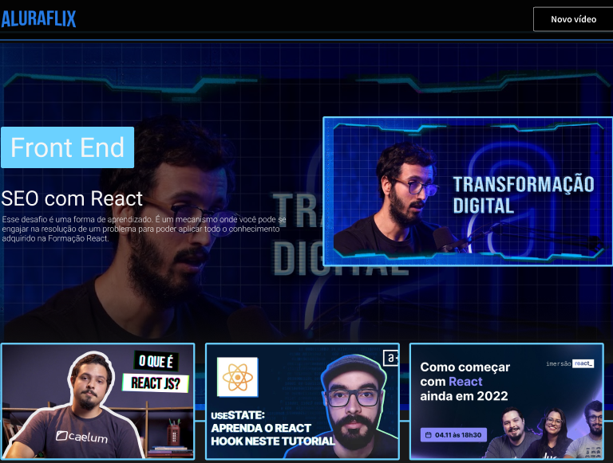

# Projeto Challenge Aluraflix Turma 5 da Alura + Oracle  

# Descrição do projeto
Criação de site de streaming para fins educacionais..
Projeto Challenge do Aluraflix-PZS é ser um Netflix da Alura. Nele você terá sugestões de vídeos relacionados com os seus interesses educacionais, além disso poderá adicionar novas categorias e novos videos.

## Aluraflix-PZS 

Tecnologias Utilizadas:

 React JS + Vite 

 Material UI

# Deploy do projeto:https://aluraflix-pzs-vercel.vercel.app

# Badge :

[]

Currently, two official plugins are available:

- [@vitejs/plugin-react](https://github.com/vitejs/vite-plugin-react/blob/main/packages/plugin-react/README.md) uses [Babel](https://babeljs.io/) for Fast Refresh
- [@vitejs/plugin-react-swc](https://github.com/vitejs/vite-plugin-react-swc) uses [SWC](https://swc.rs/) for Fast Refresh
